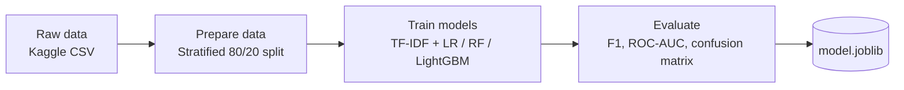
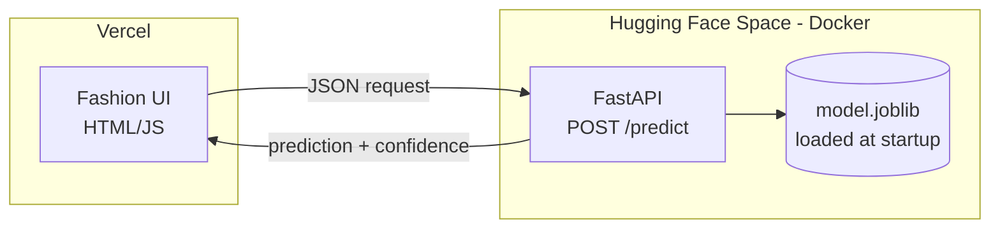

# Fashion Review Recommendation Predictor

Predicts whether a customer will recommend a clothing item based on
their review text, age, and product category.

**Live demo:** (add link after deployment)

## Highlights
- End-to-end ML workflow: EDA, preprocessing, modeling, evaluation, deployment
- Compared Logistic Regression, Random Forest, and LightGBM
- Evaluated with F1 and ROC-AUC to handle class imbalance
- Analyzed the Rating feature's leakage-like effect and excluded it
- Served through a FastAPI endpoint with a web frontend on Vercel

## Tech stack
Python, pandas, scikit-learn, LightGBM, FastAPI, Hugging Face Spaces, Vercel

## Architecture

### 1. Training workflow (offline)



### 2. Serving architecture (online)



### API contract

```
POST /predict

Request:
{
  "review_text": "Love the fit, but the fabric feels thin.",
  "age": 28,
  "department": "Dresses",
  "class_name": "Knits"
}

Response:
{
  "recommended": true,
  "confidence": 0.87
}
```

### Project structure

```
fashion-review-predictor/
├── notebooks/    # EDA, baseline, model comparison
├── src/          # preprocessing and training scripts
├── backend/      # FastAPI app, Dockerfile, model.joblib
├── frontend/     # web UI (deployed on Vercel)
└── README.md
```

